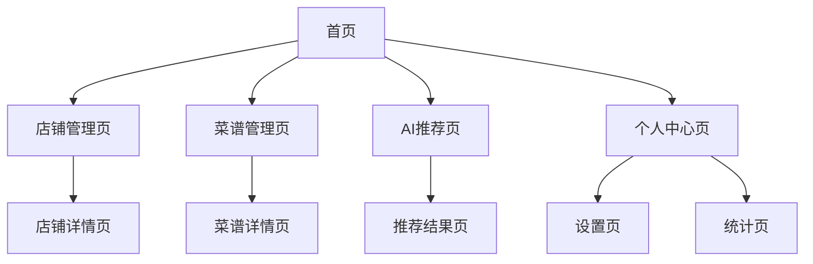

## 1. 产品概述
"吃什么"是一款解决用户日常饮食选择困难问题的个人应用。通过智能推荐系统帮助用户快速决定吃什么，支持店铺和菜谱管理，提供个性化的饮食建议。

目标用户：有选择困难症、追求饮食多样化、注重健康饮食的都市人群。

## 2. 核心功能

### 2.1 用户角色
| 角色 | 注册方式 | 核心权限 |
|------|----------|----------|
| 普通用户 | 邮箱/手机号注册 | 管理店铺、菜谱，使用AI推荐，查看饮食记录 |

### 2.2 功能模块
应用包含以下主要页面：
1. **首页**：推荐内容展示、快速决策入口、今日饮食建议
2. **店铺管理页**：店铺列表、导入功能、评分排序、分类筛选
3. **菜谱管理页**：菜谱列表、导入功能、分类管理、收藏笔记
4. **AI推荐页**：智能推荐、场景选择、推荐理由展示
5. **个人中心页**：用户信息、饮食记录、偏好设置、数据统计

### 2.3 页面详情
| 页面名称 | 模块名称 | 功能描述 |
|----------|----------|----------|
| 首页 | 推荐轮播 | 展示今日推荐店铺和菜谱，支持左右滑动切换 |
| 首页 | 快速决策 | 一键随机推荐，考虑用户偏好和历史记录 |
| 首页 | 场景选择 | 提供工作日午餐、周末聚餐、家庭烹饪等场景选项 |
| 店铺管理页 | 店铺列表 | 展示所有店铺，支持评分排序和分类筛选 |
| 店铺管理页 | 导入功能 | 支持美团/淘宝店铺图片上传和OCR识别 |
| 店铺管理页 | 评分系统 | 1-5星评分，支持修改和删除 |
| 店铺管理页 | 分类管理 | 区分外卖店铺和实体店铺，支持自定义标签 |
| 菜谱管理页 | 菜谱列表 | 展示所有菜谱，支持按菜系、难度、时间筛选 |
| 菜谱管理页 | 导入功能 | 支持小红书帖子图片上传和OCR识别 |
| 菜谱管理页 | 收藏笔记 | 收藏喜欢的菜谱，添加个人制作笔记 |
| AI推荐页 | 智能推荐 | 基于DeepSeek AI提供个性化推荐 |
| AI推荐页 | 推荐理由 | 展示推荐依据，包括用户偏好、营养成分等 |
| AI推荐页 | 重新推荐 | 支持用户不满意时重新生成推荐 |
| 个人中心页 | 用户信息 | 显示头像、昵称、注册时间等基本信息 |
| 个人中心页 | 饮食记录 | 记录每日饮食选择，支持手动添加 |
| 个人中心页 | 偏好设置 | 设置口味偏好、过敏食材、饮食禁忌 |
| 个人中心页 | 数据统计 | 展示饮食多样性、营养均衡等统计图表 |

## 3. 核心流程

### 用户主要操作流程：
1. 新用户注册登录后，首先导入已有的店铺和菜谱信息
2. 日常使用主要通过首页快速决策功能获取推荐
3. 根据推荐结果选择就餐或烹饪，系统记录选择历史
4. 定期查看个人中心的饮食记录和统计，优化个人偏好设置

### 页面导航流程：

## 4. 用户界面设计

### 4.1 设计风格
- **主色调**：温暖橙色(#FF6B35)搭配清新绿色(#4CAF50)
- **辅助色**：中性灰色系，用于背景和文字
- **按钮风格**：圆角矩形，悬停有微动画效果
- **字体**：优先使用系统默认字体，标题加粗，正文字号16px
- **布局风格**：卡片式布局，阴影效果，清晰的信息层级
- **图标风格**：使用圆润的线性图标，符合食品应用调性

### 4.2 页面设计概览
| 页面名称 | 模块名称 | UI元素 |
|----------|----------|--------|
| 首页 | 推荐轮播 | 全宽卡片，食物图片背景，半透明文字遮罩，左右滑动指示器 |
| 首页 | 快速决策 | 大圆形按钮，中心为餐具图标，点击有旋转动画 |
| 店铺管理页 | 店铺卡片 | 左侧图片，右侧信息，底部评分星星，右上角收藏图标 |
| 菜谱管理页 | 菜谱网格 | 2列网格布局，图片上方显示菜名和难度标签 |
| AI推荐页 | 推荐卡片 | 全屏展示，背景模糊效果，突出推荐内容 |
| 个人中心页 | 统计图表 | 使用饼图和柱状图展示饮食数据，颜色温和 |

### 4.3 响应式设计
- **桌面端**：最大宽度1200px，侧边栏导航，多列布局
- **平板端**：最大宽度768px，顶部导航，自适应列数
- **移动端**：全屏宽度，底部标签导航，单列布局
- **触摸优化**：按钮最小44px，支持滑动操作，手势识别

### 4.4 动效设计
- 页面切换使用淡入淡出效果，时长300ms
- 卡片悬停时上浮2px，阴影加深
- 按钮点击有缩放效果，缩放比例0.95
- 加载使用骨架屏，避免突兀的空白页面