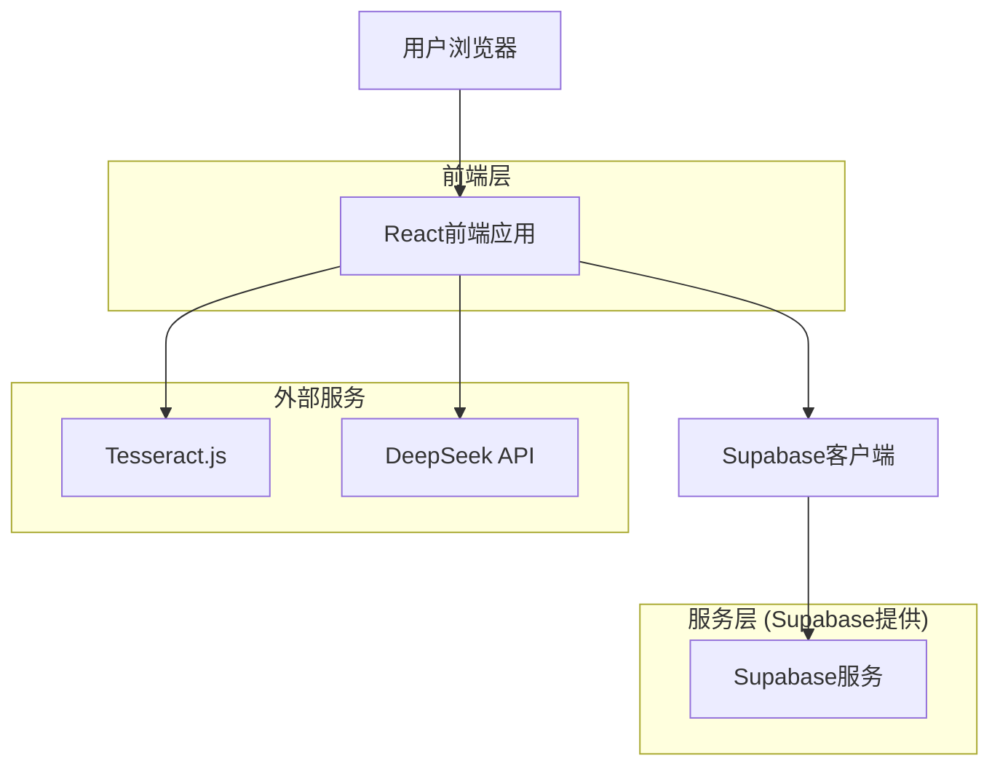
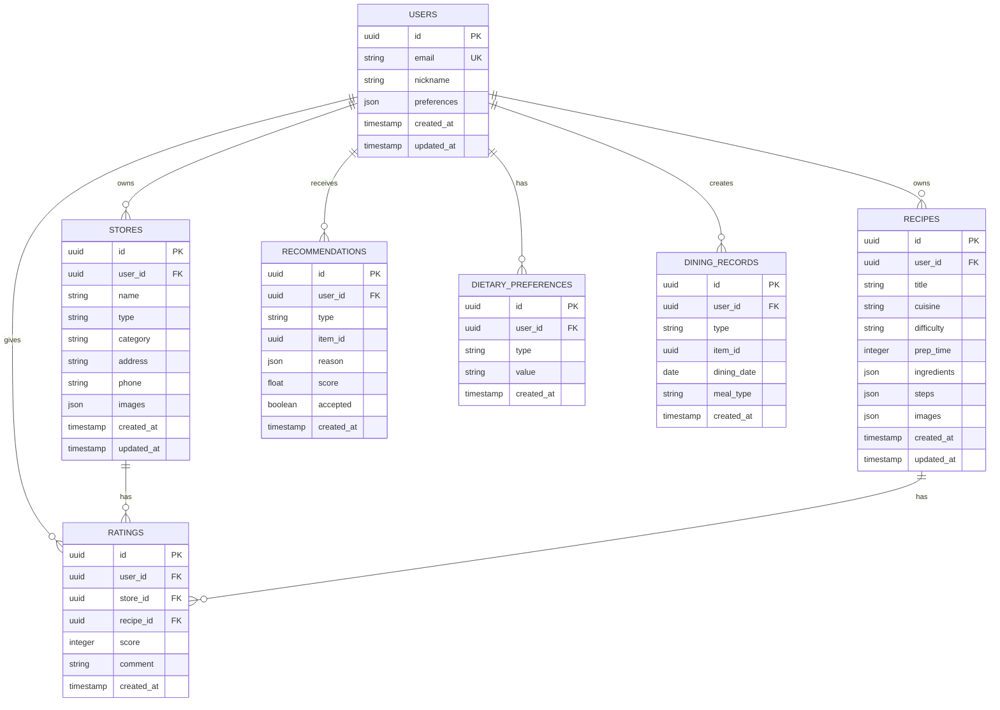

## 1. 架构设计



## 2. 技术描述

- **前端框架**: React@18 + TypeScript + Vite
- **UI库**: Ant Design@5 + Tailwind CSS@3
- **状态管理**: React Context + Zustand
- **初始化工具**: vite-init
- **后端服务**: Supabase (数据库+认证+存储)
- **OCR识别**: Tesseract.js
- **AI推荐**: DeepSeek API

## 3. 路由定义

| 路由 | 用途 |
|------|------|
| / | 首页，推荐内容展示 |
| /login | 登录页面 |
| /register | 注册页面 |
| /stores | 店铺管理页面 |
| /stores/import | 店铺导入页面 |
| /stores/:id | 店铺详情页面 |
| /recipes | 菜谱管理页面 |
| /recipes/import | 菜谱导入页面 |
| /recipes/:id | 菜谱详情页面 |
| /ai-recommend | AI推荐页面 |
| /profile | 个人中心页面 |
| /profile/settings | 设置页面 |
| /profile/statistics | 数据统计页面 |

## 4. API定义

### 4.1 认证相关API

**用户注册**
```
POST /auth/v1/signup
```

请求体:
```json
{
  "email": "user@example.com",
  "password": "password123",
  "data": {
    "nickname": "美食家"
  }
}
```

**用户登录**
```
POST /auth/v1/token?grant_type=password
```

请求体:
```json
{
  "email": "user@example.com",
  "password": "password123"
}
```

### 4.2 店铺管理API

**获取店铺列表**
```
GET /rest/v1/stores?select=*&user_id=eq.xxx&order=rating.desc
```

**创建店铺**
```
POST /rest/v1/stores
```

请求体:
```json
{
  "name": "川味轩",
  "type": "restaurant",
  "category": "川菜",
  "rating": 4.5,
  "address": "某某街道",
  "phone": "13800138000",
  "user_id": "xxx"
}
```

**更新店铺信息**
```
PATCH /rest/v1/stores?id=eq.xxx
```

**删除店铺**
```
DELETE /rest/v1/stores?id=eq.xxx
```

### 4.3 菜谱管理API

**获取菜谱列表**
```
GET /rest/v1/recipes?select=*&user_id=eq.xxx&order=created_at.desc
```

**创建菜谱**
```
POST /rest/v1/recipes
```

请求体:
```json
{
  "title": "宫保鸡丁",
  "cuisine": "川菜",
  "difficulty": "medium",
  "prep_time": 30,
  "ingredients": ["鸡胸肉", "花生米", "干辣椒"],
  "steps": ["步骤1", "步骤2"],
  "user_id": "xxx"
}
```

### 4.4 AI推荐API

**获取智能推荐**
```
POST /api/recommendations
```

请求体:
```json
{
  "user_id": "xxx",
  "scenario": "lunch",
  "preferences": {
    "cuisine": ["川菜", "粤菜"],
    "budget": "medium",
    "dietary_restrictions": ["不吃辣"]
  }
}
```

响应:
```json
{
  "recommendations": [
    {
      "type": "store",
      "id": "xxx",
      "name": "川味轩",
      "reason": "基于您的川菜偏好推荐",
      "score": 0.85
    }
  ]
}
```

## 5. 数据模型

### 5.1 数据模型定义



### 5.2 数据定义语言

**用户表 (users)**
```sql
-- 创建用户表
CREATE TABLE users (
    id UUID PRIMARY KEY DEFAULT gen_random_uuid(),
    email VARCHAR(255) UNIQUE NOT NULL,
    nickname VARCHAR(100) NOT NULL,
    preferences JSONB DEFAULT '{}',
    created_at TIMESTAMP WITH TIME ZONE DEFAULT NOW(),
    updated_at TIMESTAMP WITH TIME ZONE DEFAULT NOW()
);

-- 创建索引
CREATE INDEX idx_users_email ON users(email);
CREATE INDEX idx_users_created_at ON users(created_at DESC);
```

**店铺表 (stores)**
```sql
-- 创建店铺表
CREATE TABLE stores (
    id UUID PRIMARY KEY DEFAULT gen_random_uuid(),
    user_id UUID REFERENCES users(id) ON DELETE CASCADE,
    name VARCHAR(255) NOT NULL,
    type VARCHAR(50) NOT NULL CHECK (type IN ('restaurant', 'takeout')),
    category VARCHAR(100),
    address TEXT,
    phone VARCHAR(20),
    images JSONB DEFAULT '[]',
    created_at TIMESTAMP WITH TIME ZONE DEFAULT NOW(),
    updated_at TIMESTAMP WITH TIME ZONE DEFAULT NOW()
);

-- 创建索引
CREATE INDEX idx_stores_user_id ON stores(user_id);
CREATE INDEX idx_stores_type ON stores(type);
CREATE INDEX idx_stores_created_at ON stores(created_at DESC);
```

**菜谱表 (recipes)**
```sql
-- 创建菜谱表
CREATE TABLE recipes (
    id UUID PRIMARY KEY DEFAULT gen_random_uuid(),
    user_id UUID REFERENCES users(id) ON DELETE CASCADE,
    title VARCHAR(255) NOT NULL,
    cuisine VARCHAR(100),
    difficulty VARCHAR(20) CHECK (difficulty IN ('easy', 'medium', 'hard')),
    prep_time INTEGER,
    ingredients JSONB DEFAULT '[]',
    steps JSONB DEFAULT '[]',
    images JSONB DEFAULT '[]',
    created_at TIMESTAMP WITH TIME ZONE DEFAULT NOW(),
    updated_at TIMESTAMP WITH TIME ZONE DEFAULT NOW()
);

-- 创建索引
CREATE INDEX idx_recipes_user_id ON recipes(user_id);
CREATE INDEX idx_recipes_cuisine ON recipes(cuisine);
CREATE INDEX idx_recipes_created_at ON recipes(created_at DESC);
```

**评分表 (ratings)**
```sql
-- 创建评分表
CREATE TABLE ratings (
    id UUID PRIMARY KEY DEFAULT gen_random_uuid(),
    user_id UUID REFERENCES users(id) ON DELETE CASCADE,
    store_id UUID REFERENCES stores(id) ON DELETE CASCADE,
    recipe_id UUID REFERENCES recipes(id) ON DELETE CASCADE,
    score INTEGER NOT NULL CHECK (score >= 1 AND score <= 5),
    comment TEXT,
    created_at TIMESTAMP WITH TIME ZONE DEFAULT NOW(),
    CONSTRAINT check_item CHECK (
        (store_id IS NOT NULL AND recipe_id IS NULL) OR
        (store_id IS NULL AND recipe_id IS NOT NULL)
    )
);

-- 创建索引
CREATE INDEX idx_ratings_user_id ON ratings(user_id);
CREATE INDEX idx_ratings_store_id ON ratings(store_id);
CREATE INDEX idx_ratings_recipe_id ON ratings(recipe_id);
CREATE INDEX idx_ratings_created_at ON ratings(created_at DESC);
```

**推荐记录表 (recommendations)**
```sql
-- 创建推荐记录表
CREATE TABLE recommendations (
    id UUID PRIMARY KEY DEFAULT gen_random_uuid(),
    user_id UUID REFERENCES users(id) ON DELETE CASCADE,
    type VARCHAR(50) NOT NULL CHECK (type IN ('store', 'recipe')),
    item_id UUID NOT NULL,
    reason JSONB DEFAULT '{}',
    score FLOAT,
    accepted BOOLEAN DEFAULT FALSE,
    created_at TIMESTAMP WITH TIME ZONE DEFAULT NOW()
);

-- 创建索引
CREATE INDEX idx_recommendations_user_id ON recommendations(user_id);
CREATE INDEX idx_recommendations_created_at ON recommendations(created_at DESC);
```

**饮食记录表 (dining_records)**
```sql
-- 创建饮食记录表
CREATE TABLE dining_records (
    id UUID PRIMARY KEY DEFAULT gen_random_uuid(),
    user_id UUID REFERENCES users(id) ON DELETE CASCADE,
    type VARCHAR(50) NOT NULL CHECK (type IN ('store', 'recipe')),
    item_id UUID NOT NULL,
    dining_date DATE NOT NULL,
    meal_type VARCHAR(20) CHECK (meal_type IN ('breakfast', 'lunch', 'dinner', 'snack')),
    created